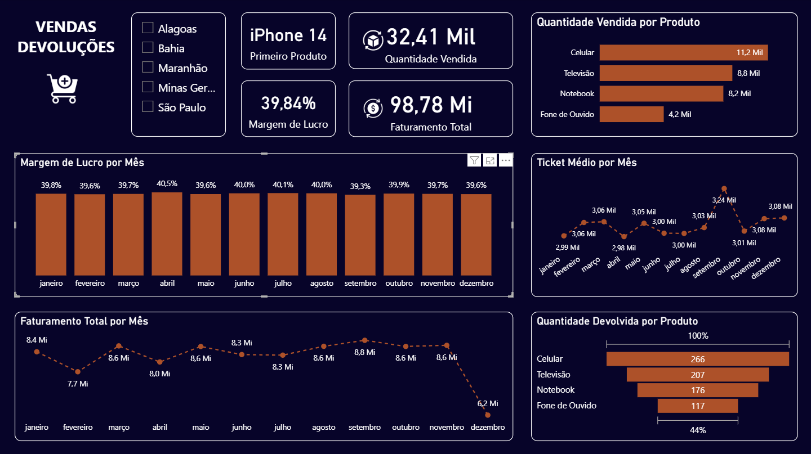

# dashboard-vendas-powerbi
Dashboard interativo em Power BI para análise de vendas e devoluções.

# Dashboard de Vendas e Devoluções 📊

Este projeto foi desenvolvido no Power BI e tem como objetivo analisar de forma clara e interativa os principais indicadores de vendas e devoluções de produtos.

> ⚠️ **Atenção:** Os dados utilizados neste projeto são totalmente fictícios e foram gerados com fins exclusivamente educacionais. Eles não representam informações reais de nenhuma empresa ou instituição.

## 📌 Visão Geral

O dashboard apresenta:

- Faturamento total por mês
- Quantidade vendida por produto
- Ticket médio por mês
- Lucro total e margem de lucro mensal
- Devoluções por produto
- Filtros por estado (UF)

## 📈 Principais Métricas

- **Faturamento Total:** R$ 98,78 milhões  
- **Quantidade Vendida:** 32,41 mil unidades  
- **Produto mais vendido:** iPhone 14  
- **Margem de Lucro:** 39,84%  
- **Maior devolução:** Celular (266 unidades)

## ⚙️ Ferramentas utilizadas

- Power BI Desktop
- DAX (para criação de medidas como Ticket Médio e Margem de Lucro)
- Power Query (tratamento dos dados)

## 📁 Arquivo

- `dashboard.pbix` – Arquivo editável do Power BI

## 💡 Insights

A análise permite entender melhor os produtos com maior rentabilidade, o comportamento mensal das vendas e os produtos com maior índice de devolução — auxiliando a tomada de decisões estratégicas.

---

📌 **Desenvolvido por:** Clara Delboni  
💡 Este projeto foi originalmente criado como parte de um exercício prático durante meu curso de Power BI. O layout, visualizações e elementos foram adaptados e customizados por mim para fins de portfólio.

🔗 [www.linkedin.com/in/claradelboni](https://www.linkedin.com/in/claradelboni)
